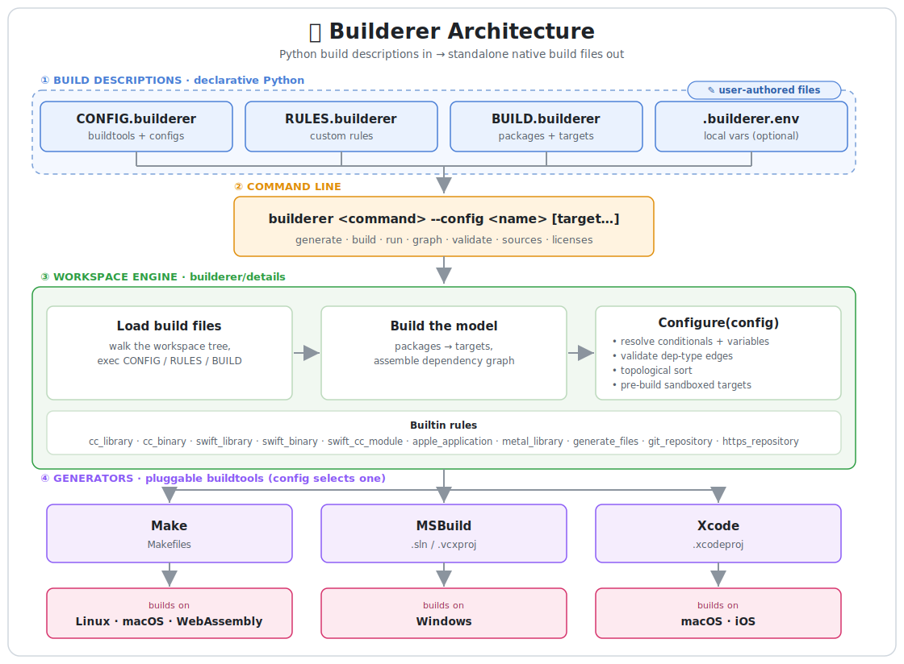

# 🏗️ Builderer - a fast, dependency-free, build-file generator

## Documentation

- **[Getting Started](docs/getting-started.md)** - Installation and quick start guide
- **[Build Files](docs/build-files.md)** - Define targets, dependencies, and external libraries
- **[Configuration](docs/configuration.md)** - Configure platforms, toolchains, and conditionals
- **[Commands](docs/commands.md)** - Generate, build, run, and manage projects
- **[Examples](https://github.com/builderer/builderer-examples)** - repository with example buildable projects

## What is Builderer?

Builderer generates native build files from build descriptions written in plain Python. It targets C/C++/Objective-C/Swift projects that need to build for multiple platforms and toolchains (see the matrix below) from a single source of truth.

Like CMake, Premake, and GN, Builderer is a build-file *generator* rather than a build system — it produces input for the native tools you already use. The difference is that its output is self-contained: generated files never call back into Builderer, so teammates, CI, and clients can build them without installing it.

Builderer itself is just as unobtrusive: by design it's never a system-wide install — run it from a Python virtual environment or vendor it straight into your repository. Each project pins the exact version it needs, so separate repositories never conflict over a shared one.

### Architecture

You author your build in declarative Python (`CONFIG.builderer`, `RULES.builderer`, `BUILD.builderer`). The CLI loads the workspace, builds a dependency graph of your targets, and resolves it for the chosen config. A pluggable generator then emits the standalone native build files for that toolchain.

  

### Supported Platforms and Build Systems

| Build System | Windows  | Linux    | macOS    | iOS      | WebAssembly |
|--------------|----------|----------|----------|----------|-------------|
| **Makefile** |          | &#10003; | &#10003; |          | &#10003;    |
| **MSBuild**  | &#10003; |          |          |          |             |
| **Xcode**    |          |          | &#10003; | &#10003; |             |

## Why Builderer?

Builderer exists to make cross-platform native builds simple to define, fast to generate, and easy to hand off — without adopting a heavyweight meta-build system or learning a custom DSL.

### Zero System Dependencies
- **Only requires Python 3.9+** - no other system-level dependencies needed
- **No system-wide installation** - use a virtual environment, git submodule, or copy directly into your repository
- **Per-project versioning** - each project can use its own Builderer version without conflicts

### Real Python, Not a DSL
- **Actual Python syntax** - not a Python-like DSL or an old Python fork
- **Familiar to developers** - Python is the world's most popular programming language
- **Simple guardrails** - `CONFIG.builderer`, `RULES.builderer`, and `BUILD.builderer` files provide structure
- **API inspired by Bazel/Buck** - familiar patterns without rigid constraints

### Native Build Files
- **Standalone output** - generated build files don't depend on Builderer
- **IDE integration** - open the generated projects directly in your IDE, no Builderer extension required
- **Standard tooling support** - static analyzers, profilers, and debuggers work natively
- **Transferable projects** - share generated build files with clients or teammates without Builderer

### Multi-Configuration Support
- **Deferred conditionals** - generate projects that support multiple configurations and architectures
- **Single generation** - produce build files for every build configuration and architecture in one pass
- **Configuration branches in build files** - switch configurations in your IDE without regenerating

### Fast and Scalable
- **Fast generation** - typically well under a second, even for large projects
- **Scoped generation** - generate a single target and its dependency subgraph, so a large mono-repo opens as a focused project containing only what you're working on
- **Smart updates** - only touches files that changed, so IDEs reload seamlessly

### Extensible and Approachable
- **Small, readable codebase** - implemented in straightforward Python
- **Easy to customize** - fork and adapt for your project's unique needs without affecting other projects

### Explicit Yet Concise
- **No magic defaults** - Builderer doesn't make implicit decisions about your build configuration
- **Clear and predictable** - what you write in your build files is exactly what gets generated
- **Still concise** - despite being explicit, target definitions are often just a few lines long
- **Workspace-wide defaults** - use `RULES.builderer` to define common settings once and apply them everywhere
